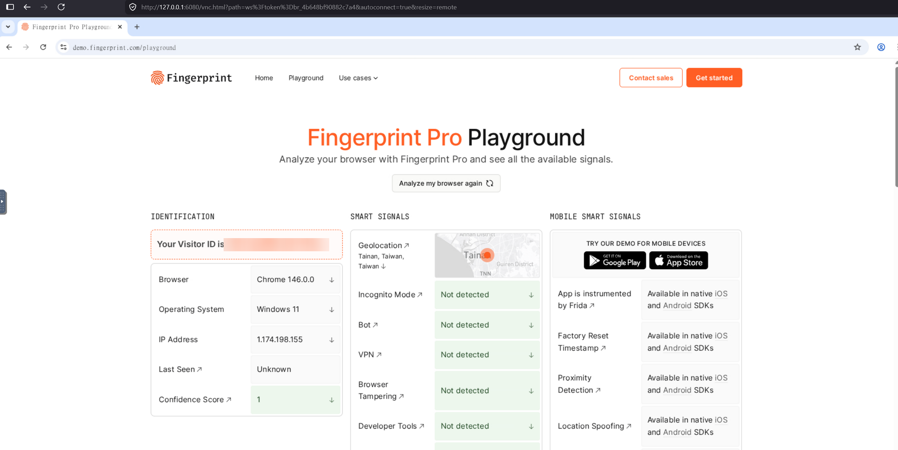

<p align="center">
  
</p>

<p align="center">
  <a href="https://pypi.org/project/rayobrowse/"></a>
  <a href="https://www.npmjs.com/package/rayobrowse"></a>
  <a href="LICENSE"></a>
  <a href="https://github.com/rayobyte-data/rayobrowse"></a>
  <br>
  <a href="https://github.com/rayobyte-data/rayobrowse"></a>
  <a href="https://pypi.org/project/rayobrowse/"></a>
  <a href="https://www.npmjs.com/package/rayobrowse"></a>
</p>

<p align="center">
  <a href="https://docs.rayobrowse.com">Docs</a> ·
  <a href="#quick-start">Quick Start</a> ·
  <a href="#what-rayobrowse-handles">Fingerprints</a> ·
  <a href="#self-hosted-and-cloud">Self-Hosted and Cloud</a>
</p>

<h3 align="center">Self-hosted Chromium stealth browser for web scraping and automation.</h3>

rayobrowse is a Chromium-based browser built to look like a real user in
server-side automation. It gives each session a coherent fingerprint across
browser APIs, graphics, fonts, language, timezone, WebRTC, automation surfaces,
and network-facing behavior.

It exposes standard CDP, so you can use it from Playwright, Puppeteer,
Selenium, Scrapy, OpenClaw, or your own automation code without learning a new
browser API.

Rayobyte uses rayobrowse at billion-page-per-month scale on major websites for its [web scraping API](https://rayobyte.com/products/web-scraping-api/). We
have been in the web scraping industry for 11 years, and this browser is part
of the infrastructure we rely on ourselves.

## Quick Start

Self-hosted rayobrowse is free and unlimited. Docker is the only required
runtime dependency.

```bash
git clone https://github.com/rayobyte-data/rayobrowse.git
cd rayobrowse
docker compose up -d
curl http://localhost:9222/health
```

### Connect with Playwright

`/connect` is an HTTP endpoint. It starts a browser and returns a CDP WebSocket
URL as plain text.

```python
# pip install httpx playwright && playwright install
import httpx
from playwright.sync_api import sync_playwright

r = httpx.get(
    "http://localhost:9222/connect",
    params={"os": "windows", "headless": "false", "vnc": "true"},
    timeout=120,
)
r.raise_for_status()
cdp_url = r.text.strip()
vnc_url = r.headers.get("x-vnc-url") or "http://localhost:6080/vnc.html"

with sync_playwright() as p:
    browser = p.chromium.connect_over_cdp(cdp_url)
    context = browser.contexts[0] if browser.contexts else browser.new_context()
    page = context.pages[0] if context.pages else context.new_page()
    page.goto("https://browserscan.net/")
    print(page.title())
    print(f"To view your browser in VNC go to: {vnc_url}")
    input("Press Enter to close the browser...")
    browser.close()
```

The browser is cleaned up when the CDP session closes. For long-running
sessions, reconnects, and explicit lifecycle control, use the SDK or the
session management APIs.

For SDKs, session reuse, VNC, proxies, and integration guides, use
[docs.rayobrowse.com](https://docs.rayobrowse.com).

## Detection Coverage

rayobrowse is built for protected, real-world targets and common fingerprint
test suites.


| System                          | Status                                     |
| ------------------------------- | ------------------------------------------ |
| Cloudflare                      | ✅                                          |
| Akamai                          | ✅                                          |
| PerimeterX / HUMAN              | ✅                                          |
| demo.fingerprint.com/playground | ✅                                          |
| BrowserScan                     | ✅                                          |
| PixelScan                       | ✅                                          |


<p align="center">
  
</p>


## What rayobrowse handles

Each session gets a coherent device profile across browser APIs, graphics,
networking, automation surfaces, and OS-level behavior. Covered signals include:

- User agent, browser version, client hints, platform, and OS metadata.
- Windows, Linux, macOS, and Android fingerprint support.
- Viewport, screen size, color depth, device scale factor, and media queries.
- WebGL vendor, renderer, extensions, parameters, shaders, and GPU consistency.
- Canvas output, text rendering, image rendering, and graphics behavior.
- AudioContext and audio processing fingerprints.
- OS-matched fonts and font rendering behavior.
- Timezone, locale, language, Accept-Language, and UI language.
- Navigator fields, permissions, plugins, MIME types, hardware concurrency,
memory, touch support, and related browser surfaces.
- WebRTC, DNS leak behavior, proxy alignment, and network-facing attributes.
- Automation surfaces, CDP artifacts, launch flags, process behavior, and
headless/headful consistency.
- Human-like mouse movement and click timing.

## Architecture

rayobrowse runs as a Docker container with:

- A Chromium-based browser binary.
- The stealth fingerprint engine.
- An HTTP daemon for `/connect`, browser close, status, health, and CDP proxy
endpoints.
- Optional noVNC viewing for live debugging.

Your automation code runs on the host and connects over CDP. You do not need a
host Chromium install, GPU setup, Xvfb, font packages, or custom browser flags.

## Why Docker Only

The hardest version of this problem is running a stealth browser reliably at
scale on Linux servers without GPUs. That is where scraping teams actually run
production workloads, so that is where we put our effort.

Docker lets rayobrowse ship the browser binary, patched runtime, fonts,
graphics stack, fingerprint engine, daemon, and VNC support as one reproducible
environment. You can run the same browser locally, in CI, on bare metal, or
across a cloud fleet without rebuilding a fragile desktop browser setup on
every machine.

## Self-Hosted and Cloud

Self-hosted rayobrowse is free and unlimited. Run it on your own machines, use
your own proxies, and get the same core stealth engine in every release. Local
use does not require registration.

rayobrowse Cloud is for teams that want the same `/connect` workflow without
owning the browser fleet. At scale, browsers are expensive to manage: you need
servers, proxy capacity, orchestration, queueing, monitoring, updates, zombie
cleanup, debugging tools, and engineers to keep the whole system healthy.

Cloud takes that operational work off your plate with managed browser capacity,
proxy integration, VNC access, observability, and automatic updates. You call
`/connect`, receive a CDP URL, and automate the browser the same way you do
locally.

For the detailed self-hosted and Cloud comparison, read
[docs.rayobrowse.com](https://docs.rayobrowse.com) or contact
[sales@rayobyte.com](mailto:sales@rayobyte.com) for early access.

## License

The repository wrapper, examples, docs, and configuration files are MIT
licensed. The rayobrowse Browser Binary has a separate license that allows most
commercial and hobby use, while restricting illegal or unethical use and
certain commercial resale categories.

See [LICENSE](LICENSE) and
[BROWSER_BINARY_LICENSE.md](BROWSER_BINARY_LICENSE.md).

## Legal and Ethics

Use rayobrowse only for legal and ethical automation and web data collection.
Do not use it for credential attacks, fraud, spam, unauthorized access,
harassment, malware, or other harmful activity.

Rayobyte is a proud partner of the [EWDCI](https://ethicalwebdata.com/) and
takes ethical web scraping seriously.

## Support

- Docs: [docs.rayobrowse.com](https://docs.rayobrowse.com)
- Bugs and feature requests: open a GitHub issue.
- Cloud early access and commercial inquiries:
[sales@rayobyte.com](mailto:sales@rayobyte.com)

